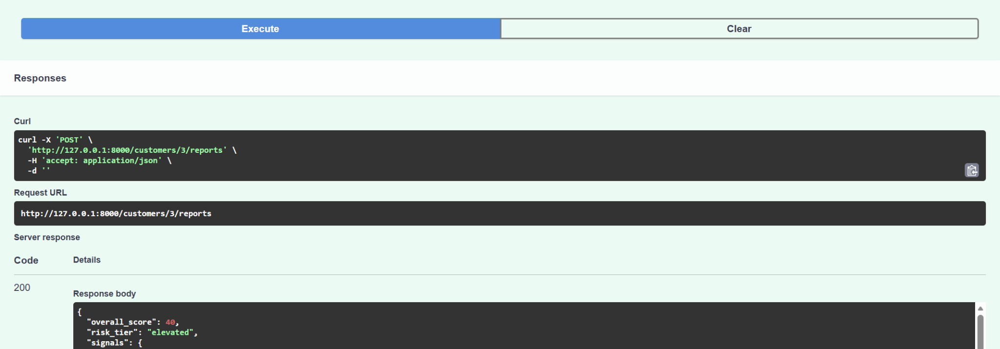

# CashFlowIQ

CashFlowIQ turns three complete months of bank transactions into a transparent **0–100 cash-flow risk score** and a plain-English explanation.

I built it to explore a simple question: how can someone with limited credit history show evidence of responsible financial behavior? CashFlowIQ looks at current cash flow—income consistency, recurring expenses, overdrafts, and net cash flow—then explains the result in language a person can understand.

> CashFlowIQ is a portfolio project. It demonstrates backend architecture and explainable scoring; it is not a validated lending model.

[Why CashFlowIQ](#why-cashflowiq) · [How It Works](#how-it-works) · [Scoring Model](#scoring-model) · [Example Response](#example-response) · [API and Local Setup](#api-and-local-setup) · [Tests](#tests) · [Limitations](#limitations) · [Technical Decisions](#technical-decisions)



## Why CashFlowIQ

Traditional credit scores largely reflect how a person handled borrowed money in the past. That can make thin-file or no-file applicants harder to evaluate, even when their current finances are stable.

CashFlowIQ explores a second source of context: bank-transaction behavior. The goal is not to replace a credit score. It is to show how a clear, deterministic cash-flow model could support a more complete review.

The core rule is:

> **The scoring code decides. The LLM only explains.**

## How It Works

```text
POST /customers/{customer_id}/reports
                |
                v
Query a fixed three-month transaction window
                |
                v
Calculate four deterministic signal scores
                |
                v
Calculate the weighted score and risk tier
                |
                v
Convert signal scores to qualitative labels
                |
                v
Generate a structured Claude explanation
```

The score and tier remain the authoritative result. Claude does not receive raw transactions, calculate the score, or change the decision. If explanation generation fails, the API still returns the deterministic report.

## Scoring Model

| Signal | Weight | Measures |
|---|---:|---|
| Income stability | 15% | Consistency of monthly qualifying income |
| Recurring expense ratio | 25% | Recurring expenses relative to income |
| Overdraft count | 30% | Overdraft or NSF fees in the observation window |
| Net cash flow ratio | 30% | Income remaining after relevant outflows |

Each signal receives a score from 0–100. The weighted result is rounded once and mapped to a tier:

```text
80–100: low
60–79:  moderate
40–59:  elevated
0–39:   high
```

The scoring functions live in [`metrics.py`](metrics.py). They contain no database queries or LLM calls.

## Example Response

```json
{
  "overall_score": 40,
  "risk_tier": "elevated",
  "signals": {
    "income_stability": {"raw": 0.029, "score": 100},
    "recurring_expense_ratio": {"raw": 1.143, "score": 10},
    "overdraft_count": {"raw": 2, "score": 45},
    "net_cash_flow_ratio": {"raw": -0.154, "score": 30}
  },
  "explanation": {
    "summary": "Income stability is a strength, while the remaining signals are concerns.",
    "key_strengths": ["Income stability"],
    "key_concerns": [
      "Recurring expense ratio",
      "Overdraft count",
      "Net cash flow ratio"
    ],
    "principal_risk_factors": [
      "Recurring expense ratio",
      "Overdraft count",
      "Net cash flow ratio"
    ]
  },
  "explanation_status": "available"
}
```

## API and Local Setup

### Main endpoint

```http
POST /customers/{customer_id}/reports
```

- `200` — report generated
- `404` — customer not found
- `422` — available transaction data cannot produce a valid report

### Run locally

```powershell
git clone https://github.com/007-ash/cashflowiq.git
cd cashflowiq

python -m venv .venv
.\.venv\Scripts\Activate.ps1
pip install -r requirements.txt

Copy-Item .env.example .env
docker compose up -d

python -c "from db import engine, Model; import models; Model.metadata.create_all(engine)"
python seed_data.py
uvicorn main:app --reload
```

Add your database URL and Anthropic key to `.env`, then open Swagger at `http://127.0.0.1:8000/docs`.

### Project structure

```text
cashflowiq/
├── routers/
│   ├── bank_account.py
│   ├── customer.py
│   ├── reports.py
│   └── transaction.py
├── tests/
│   ├── test_explanation_agent.py
│   └── test_metrics.py
├── explanation_agent.py
├── metrics.py
├── models.py
├── schemas.py
├── seed_data.py
├── decisions.md
├── data-specs.md
├── docker-compose.yml
└── main.py
```

## Tests

```powershell
pytest -q
```

The suite covers signal boundaries, monthly grouping, composite scoring, risk tiers, missing-data behavior, and structured explanation output.

Explanation tests use Pydantic AI's local `TestModel`, and live model requests are disabled during tests. Running the suite does not call Anthropic or consume API credits.

## Limitations

- Uses synthetic transaction data.
- Transaction categories are assigned rather than inferred.
- Uses a fixed three-month window.
- Score thresholds are manually calibrated and not validated against repayment outcomes.
- The public API does not yet include authentication or rate limiting.
- Generated explanations need stronger deterministic grounding before production use.

## Technical Decisions

The deeper reasoning is kept outside the front-page README:

- [`decisions.md`](decisions.md) — scoring choices, tradeoffs, and production-hardening notes
- [`data-specs.md`](data-specs.md) — transaction assumptions and signal definitions
- [`metrics.py`](metrics.py) — deterministic scoring implementation
- [`explanation_agent.py`](explanation_agent.py) — constrained LLM input and structured output
- [`routers/reports.py`](routers/reports.py) — endpoint orchestration and graceful degradation

The most important design decision is the boundary between the two layers: deterministic code owns the result; the LLM is an optional narrator.
